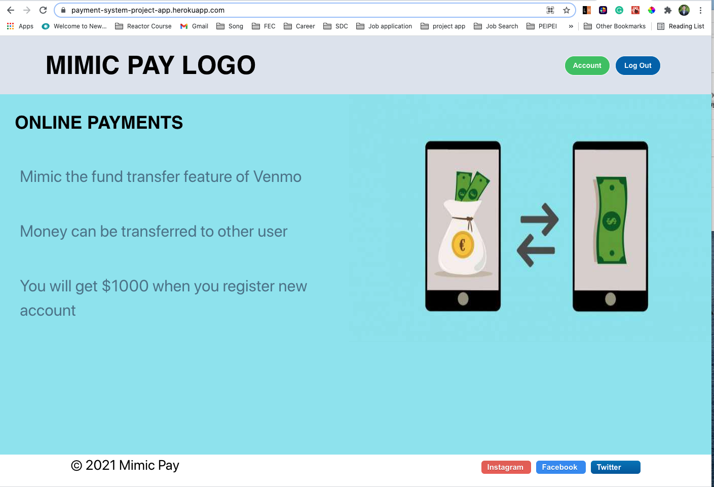

<h1 align="center">Welcome to PAYMENT-SYSTEM 👋</h1>

<p>
  
</p>

> This is a Full Stack Application by using React, Node.js, Express & MongoDB Atlas. It is a simple project to mimic a &#34;Funds Transfer&#34; like Venmo. You can query login, sign up, log out, search recipients, and transfer money through this app. Using JWT(JSON Web Tokens) for authentication and authorization.

## Heroku Link: 
```sh
https://payment-system-project-app.herokuapp.com/
```

## Tech Stack
```sh
React, Redux, React Router, Styled Component, Node.js, Express, JWT, And MongoDB Atlas.
```

## Install 

```sh
npm install
```

## Dev Usage

```sh
Go to the secretKey.sample to create the secretKey for JWT. 
npm run devBuilt
npm run deStart
```

## Author

👤 **Nick Fan**

* Github: [@https:\/\/github.com\/fanhuanliang\/](https://github.com/https:\/\/github.com\/fanhuanliang\/)
* LinkedIn: [@https:\/\/www.linkedin.com\/in\/fanhuanliang\/](https://linkedin.com/in/https:\/\/www.linkedin.com\/in\/fanhuanliang\/)

## Show your support

Give a ⭐️ if this project helped you!
